# Carcará — Component Reference

A complete reference for all 32 components of the Carcará plugin for Grasshopper / Rhino 8.

---

## Conventions

- **DB components** (subcategories 02 and 03) take `CString` (connection string) and `CToggle` (boolean trigger) as their first two inputs. Execution is guarded by `CToggle = True`.
- **Inputs** show `Name`, `Nickname`, `Type` (from `typeHintID`), and `Access` (`item` / `list` / `tree`).
- **Outputs** show `Name` and `Description` only — outputs have no nickname.
- **Access** values: `item` = single value, `list` = flat list, `tree` = DataTree.
- **Cx / Cy** correction inputs are numeric **text** (not float) representing the false-origin shift applied inside SQL via `ST_Translate`.

---

## Table of Contents

- [01.Modeling](#01modeling)
- [02.Queries](#02queries)
- [03.Utilities](#03utilities)
- [04.Dataviz](#04dataviz)

---

## 01.Modeling

Components for urban modeling tasks. Rhino-dependent geometry operations live in `crc_modules/rhino/`; pure geometry algorithms live in `crc_modules/geometry/`.

---

###  CRC_BuildingMeshes · `BdgMsh`

> Extrudes a list of building footprints by their heights.

**Inputs**

| Input | Nickname | Type | Access | Description |
|---|---|---|---|---|
| buildingFootprints | fp | polyline | tree | Tree of building footprint polygons. Holes are auto-detected by containment. |
| buildingHeights | h | float | tree | Tree of building heights matching buildingFootprints tree structure. |

**Outputs**

| Output | Description |
|---|---|
| out | Performance summary report |
| groundFaces | Ground faces with holes (ngon). One mesh per building. |
| lateralFaces | Lateral wall faces. One mesh per building. |
| rooftopFaces | Rooftop faces with holes (ngon). One mesh per building. |

---

###  CRC_IdentifyDuplicatePolylines · `IdDupPol`

> Computes a normalized signature for each polyline to handle differences in start point and direction. Groups those with identical signatures and outputs the duplicate indexes.

**Inputs**

| Input | Nickname | Type | Access | Description |
|---|---|---|---|---|
| polylines | pl | ghdoc | list | List of polyline objects to check for duplicates. |

**Outputs**

| Output | Description |
|---|---|
| duplicateIndices | DataTree of duplicate indexes. Each branch is one duplicate group. First occurrence is excluded from each group. |
| report | Status message. |

---

###  CRC_OffsetPython · `OffPy`

> Offsets planar polylines using given distances and a corner style mapping.

**Inputs**

| Input | Nickname | Type | Access | Description |
|---|---|---|---|---|
| curves | crv | curve | tree | Planar polylines to offset |
| distances | dist | float | tree | Offset distances. Single value applies to all; list is cyclic. |
| cornerStyle | cs | int | item | Corner style: 0=None, 1=Sharp (default), 2=Round, 3=Smooth, 4=Chamfer |

**Outputs**

| Output | Description |
|---|---|
| out | Processing log |
| offsetCurves | Offset curves. Failed offsets return None at same branch/index. |

---

###  CRC_PointInsidePolygon · `Pt_Plg`

> Finds the pole of inaccessibility (polylabel) for a polygon — the deepest interior point from the boundary. Falls back to centroid only when polylabel is unavailable.

**Inputs**

| Input | Nickname | Type | Access | Description |
|---|---|---|---|---|
| polygon | pol | curve | item | Closed planar polygon curve to be processed. |

**Outputs**

| Output | Description |
|---|---|
| interiorPoint | Resultant point guaranteed to be inside the polygon. |
| report | Status message. |

---

### 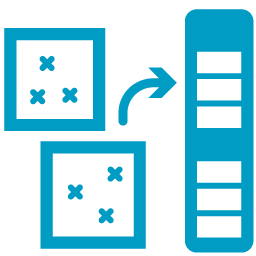 CRC_SortByContainer · `Srt_Ctn`

> Sorts a list of points by a list of containers. Output tree always matches curve count with empty branches for curves containing no points.

**Inputs**

| Input | Nickname | Type | Access | Description |
|---|---|---|---|---|
| containers | C | curve | tree | Planar closed curves used as containers. Each curve becomes one output branch. |
| points | P | point | tree | Points to sort into the container curves. If your objects are not points, create representative points first. TIP: use 'Point Inside Polygon' to get interior points for polylines. |

**Outputs**

| Output | Description |
|---|---|
| indices | Global point indices sorted by container. Branch k corresponds to containers[k] (empty branch = no points in that container). Use with 'List Item' component to sort original lists. |
| report | Status message. |

---

###  CRC_ColorCalculator · `ColorCalc`

> Calculates colors for mesh volumes based on numerical values. Supports continuous gradients, fixed class count, or custom class boundaries. Generates legend geometry and renders it directly in the Rhino viewport.

**Inputs**

| Input | Nickname | Type | Access | Description |
|---|---|---|---|---|
| valueTree | val | ghdoc | tree | Tree of values for color mapping. One value per mesh. |
| colorGrad | col | color | list | Color gradient or list of colors (min 2, default: Ladybug gradient). |
| classCount | cls | ghdoc | list | Number of classes (int, 0=continuous) OR list of class boundary floats e.g. [0,5,10]. |
| linear | lin | bool | item | True=linear intervals, False=percentile-based (default: True). |
| legendCfg | legCfg | str | item | Legend config as 'key: value' pairs (title, min, max, segments, decimals, vertical, seg_height, seg_width, text_height, scale, etc.). |
| legendPlane | legPln | plane | item | Base plane for legend positioning (default: World XY) |

**Outputs**

| Output | Description |
|---|---|
| out | Processing log |
| colors | Tree of colors for each value (structure matches input values) |
| legendGeo | Legend gradient bar mesh (with vertex colors) |
| textLocations | Text anchor points (title first, then value labels) |
| textContents | Text strings (title first, then per legend bin) |
| textSizes | Text heights (title first, then labels) |
| stats | Statistical summary (min, max, mean, median, valid count) |
| report | Status message |

---

## 02.Queries

Database communication components for reading and writing geometry and attribute data. All components take `CString` + `CToggle`. Geometry reads apply coordinate correction (Cx/Cy false origin) in SQL.

---

###  CRC_QuerySchemaNames · `QS`

> Lists all non-system schemas in a PostGIS database.

**Inputs**

| Input | Nickname | Type | Access | Description |
|---|---|---|---|---|
| CString | cs | str | item | Connection string with plain-text password (libpq format) |
| CToggle | tog | bool | item | Set True to execute |

**Outputs**

| Output | Description |
|---|---|
| schemas | List of schema names |
| report | Status message |
| queries | All SQL statements executed against the database (structured) |

---

### 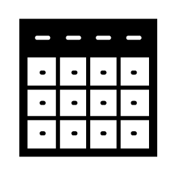 CRC_QueryTableNames · `QT`

> Lists all tables in a specified schema.

**Inputs**

| Input | Nickname | Type | Access | Description |
|---|---|---|---|---|
| CString | cs | str | item | Connection string with plain-text password (libpq format) |
| CToggle | tog | bool | item | Set True to execute |
| schema | sch | str | item | Schema name |

**Outputs**

| Output | Description |
|---|---|
| tables | List of table names |
| report | Status message |
| queries | All SQL statements executed against the database (structured) |

---

###  CRC_QueryColumnNames · `QC`

> Lists all columns and their types in a specified table.

**Inputs**

| Input | Nickname | Type | Access | Description |
|---|---|---|---|---|
| CString | cs | str | item | Connection string with plain-text password (libpq format) |
| CToggle | tog | bool | item | Set True to execute |
| schema | sch | str | item | Schema name |
| table | tbl | str | item | Table name |

**Outputs**

| Output | Description |
|---|---|
| columns | List of column names |
| types | List of column data types |
| report | Status message |
| queries | All SQL statements executed against the database (structured) |

---

###  CRC_QueryValues · `QV`

> Queries a single column from a PostGIS table, replacing NULL values with a given replacement.

**Inputs**

| Input | Nickname | Type | Access | Description |
|---|---|---|---|---|
| CString | cs | str | item | Connection string with encoded password (libpq format) |
| CToggle | tog | bool | item | Set True to execute |
| schema | sch | str | item | Schema name |
| table | tbl | str | item | Table name |
| column | col | str | item | Column name(s) to query (comma-separated for multiple) |
| nullReplacement | N | str | item | Value to replace NULL with (optional) |

**Outputs**

| Output | Description |
|---|---|
| rows | Returned rows as strings |
| columns | Column names |
| report | Status message |
| queries | All SQL statements executed against the database (structured) |

---

###  CRC_GeometryEntities · `GeoEnt`

> Draws the geometric entities from a given table with coordinate correction (false origin).

**Inputs**

| Input | Nickname | Type | Access | Description |
|---|---|---|---|---|
| CString | cs | str | item | Connection string with encoded password |
| CToggle | tog | bool | item | Set True to execute |
| schema | sch | str | item | Schema where the table is located |
| table | tbl | str | item | Table to query |
| Cx | cx | str | item | Correction X (false origin) - default 0 |
| Cy | cy | str | item | Correction Y (false origin) - default 0 |

**Outputs**

| Output | Description |
|---|---|
| geometry | Geometry list as DataTree |
| primaryKeys | Primary keys as DataTree |
| report | Status message |
| queries | All SQL statements executed against the database (structured) |

---

###  CRC_GeometriesWithSpatialFilter · `Geo_SptFlt`

> Returns geometries from a table filtered by a spatial boundary with coordinate correction.

**Inputs**

| Input | Nickname | Type | Access | Description |
|---|---|---|---|---|
| CString | cs | str | item | Connection string with encoded password |
| CToggle | tog | bool | item | Set True to execute |
| schema | sch | str | item | Schema where the table is located |
| table | tbl | str | item | Table to be queried |
| spatialFilter | flt | ghdoc | list | Grasshopper geometries to act as spatial filter (list — all polygons dissolved into a single mask) |
| srid | srid | int | item | Spatial reference identifier for the spatial filter (default 4326) |
| sqlFilter | fn | int | item | Filter function: 0 = ST_Intersects, else = ST_Contains |
| Cx | cx | str | item | Correction X (false origin) - default 0 |
| Cy | cy | str | item | Correction Y (false origin) - default 0 |

**Outputs**

| Output | Description |
|---|---|
| geometry | Geometry list as DataTree |
| primaryKeys | Primary keys as DataTree |
| report | Status message |
| queries | All SQL statements executed against the database (structured) |

---

###  CRC_ValuesWithSpatialFilter · `ValSptFlt`

> Returns a single column's values for rows intersecting a spatial filter boundary, with coordinate correction. Output is a DataTree (branch per row) parallel to CRC_GeometriesWithSpatialFilter.

**Inputs**

| Input | Nickname | Type | Access | Description |
|---|---|---|---|---|
| CString | cs | str | item | Connection string with encoded password |
| CToggle | tog | bool | item | Set True to execute |
| schema | sch | str | item | Schema where the table is located |
| table | tbl | str | item | Table to be queried |
| column | col | str | item | Single column name to query |
| nullReplacement | N | str | item | Value to replace NULL items with |
| spatialFilter | flt | ghdoc | list | Grasshopper geometries to act as spatial filter (list — all polygons dissolved into a single mask) |
| srid | srid | int | item | Spatial reference identifier for the spatial filter (default 4326) |
| sqlFilter | fn | int | item | Filter function: 0 = ST_Intersects, else = ST_Contains |
| Cx | cx | str | item | Correction X (false origin) - default 0 |
| Cy | cy | str | item | Correction Y (false origin) - default 0 |

**Outputs**

| Output | Description |
|---|---|
| values | Values as DataTree (one branch per row, ORDER BY pk) |
| primaryKeys | Primary keys as DataTree (parallel to values, one branch per row) |
| report | Status message |
| queries | All SQL statements executed against the database (structured) |

---

### 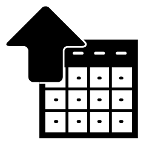 CRC_CreateTable · `CrtTbl`

> CREATE TABLE in PostGIS and INSERT row data; always adds a primary key (from Id Values or auto-increment). Destructive when replace_table=True.

**Inputs**

| Input | Nickname | Type | Access | Description |
|---|---|---|---|---|
| CString | cs | str | item | Connection string with encoded password |
| CToggle | tog | bool | item | Set True to CREATE the table and INSERT rows (destructive if replace_table=True) |
| schema | sch | str | item | Target schema |
| table | tbl | str | item | Table name to create |
| columnNames | cols | str | list | Column names (parallel to column_types) |
| columnTypes | types | str | list | SQL types parallel to column_names (e.g. text, integer, double precision) |
| values | vals | str | tree | DataTree of row data — branch per row; each branch holds values for all columns |
| idValues | ids | str | tree | Optional DataTree of primary-key values — branch per row (one id per branch); omit for auto-increment id |
| replaceTable | rep | bool | item | DROP TABLE IF EXISTS before CREATE (destructive) |

**Outputs**

| Output | Description |
|---|---|
| affected | Rows inserted |
| report | Status message |

---

###  CRC_CreateShapefile · `CrtShp`

> Creates a PostGIS table with attribute columns AND a geometry column named 'geom' (type auto-detected). Geometry is a DataTree: branch per row; more than one item per branch = multipart. Applies false-origin (Cx/Cy) add-back in SQL. Not a file export.

**Inputs**

| Input | Nickname | Type | Access | Description |
|---|---|---|---|---|
| CString | cs | str | item | Connection string with encoded password |
| CToggle | tog | bool | item | Set True to CREATE the table and INSERT rows (destructive if replace_table=True) |
| schema | sch | str | item | Target schema |
| table | tbl | str | item | Table name to create |
| columnNames | cols | str | list | Attribute column names (parallel to column_types; optional — geometry-only table allowed) |
| columnTypes | types | str | list | SQL types parallel to column_names (e.g. text, integer, double precision) |
| values | vals | str | tree | Attribute DataTree — branch per row, parallel to geometry branches (optional) |
| idValues | ids | str | tree | Optional DataTree of primary-key values — branch per row (one id per branch); omit for auto-increment id |
| geometry | geo | ghdoc | tree | Rhino geometry DataTree — branch per row; >1 item per branch = multipart (required) |
| srid | srid | int | item | SRID of the geometries (default 4326) |
| Cx | cx | str | item | Correction X — false origin added back in SQL (numeric text, default '0') |
| Cy | cy | str | item | Correction Y — false origin added back in SQL (numeric text, default '0') |
| replaceTable | rep | bool | item | DROP TABLE IF EXISTS before CREATE (destructive) |

**Outputs**

| Output | Description |
|---|---|
| affected | Rows inserted |
| report | Status message |

---

## 03.Utilities

Helper components: connection string builder, generic SQL runners, geometry/WKT converters, SQL composer, and coordinate-correction tools.

---

###  CRC_ConnectionString · `ConnStr`

> Builds a libpq connection string (CString) with plain-text password. Opens an Eto dialog to collect host/user/password; database and port come from canvas inputs.

**Inputs**

| Input | Nickname | Type | Access | Description |
|---|---|---|---|---|
| database | db | str | item | Database name to connect to |
| port | port | int | item | Port (default 5432) |
| CToggle | tog | bool | item | Set True to open the credentials dialog and test the connection |

**Outputs**

| Output | Description |
|---|---|
| CString | Connection string with plain-text password (libpq format). Feed into downstream DB components. |
| ok | True if the connection test succeeded |
| report | Status message |

---

###  CRC_FindCorrectionParameters · `FindCorr`

> Finds the coordinate correction parameters (Cx, Cy) from a PostGIS table row. Returns the centroid of the selected row as text strings for use as false-origin correction in geometry query components.

**Inputs**

| Input | Nickname | Type | Access | Description |
|---|---|---|---|---|
| CString | cs | str | item | A database connection string. |
| CToggle | tog | bool | item | Set True to connect. |
| schema | sch | str | item | Schema where the table is located. |
| table | tbl | str | item | Table to be queried. |
| column | col | str | item | Column where a specific value can be searched (optional — omit for first row). |
| value | val | str | item | Value to be searched (optional — omit for first row). |

**Outputs**

| Output | Description |
|---|---|
| Cx | Correction X — positioning correction parameter on the X axis to bring geometries closer to the origin. |
| Cy | Correction Y — positioning correction parameter on the Y axis to bring geometries closer to the origin. |
| report | Exceptions — displays errors on the query. |

---

###  CRC_SQLComposer · `SQLComp`

> Generates SQL statements by replacing variable placeholders with corresponding values.

**Inputs**

| Input | Nickname | Type | Access | Description |
|---|---|---|---|---|
| sql | sql | str | item | SQL template with placeholders (e.g., 'SELECT * FROM #table# WHERE col = #value#'). |
| variables | var | str | list | List of placeholder strings to be replaced. |
| values | val | str | list | List of replacement values corresponding to the placeholders. |

**Outputs**

| Output | Description |
|---|---|
| out | Processing log |
| statement | Final SQL statement after all replacements. |
| report | Status message |

---

###  CRC_RunQuery · `RQ`

> Runs a raw SQL SELECT against a PostGIS database and returns results as a DataTree organised by column.

**Inputs**

| Input | Nickname | Type | Access | Description |
|---|---|---|---|---|
| CString | cs | str | item | Connection string with encoded password |
| CToggle | tog | bool | item | Set True to execute |
| sql | sql | str | item | SQL SELECT statement to execute |

**Outputs**

| Output | Description |
|---|---|
| rows | DataTree of results organised by column (branch i = column i values) |
| columns | DataTree of column names mirroring rows structure (branch i = column i name) |
| report | Status message |

---

###  CRC_RunCommand · `RC`

> Runs a SQL DDL/DML command (non-SELECT) against a PostGIS database and returns execution feedback.

**Inputs**

| Input | Nickname | Type | Access | Description |
|---|---|---|---|---|
| CString | cs | str | item | Connection string with encoded password |
| CToggle | tog | bool | item | Set True to execute |
| sql | sql | str | item | SQL DDL/DML command to execute (non-SELECT) |

**Outputs**

| Output | Description |
|---|---|
| report | Execution feedback: 'success: true\nRows Affected: N' or error details |

---

###  CRC_GrasshopperGeometryToWKT · `ghToWkt`

> Converts Grasshopper geometry (points, lines/polylines, polygons) to Well-Known Text. A branch with one geometry yields a single WKT; multiple uniform geometries yield a MULTI* WKT. No coordinate correction (geometry stays local).

**Inputs**

| Input | Nickname | Type | Access | Description |
|---|---|---|---|---|
| geometry | geo | ghdoc | tree | Geometry or DataTree of geometries to convert (points, lines/polylines, polygons) |

**Outputs**

| Output | Description |
|---|---|
| WKT | Well-Known Text per branch as DataTree |
| report | Status message |

---

### 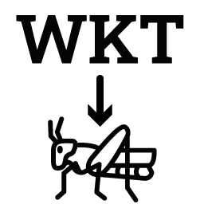 CRC_WKTtoGrasshopperGeometry · `wktToGH`

> Converts Well-Known Text (WKT) strings into Grasshopper geometry. Real multipart members share a branch; singles get their own branch. No coordinate correction (WKT is already local).

**Inputs**

| Input | Nickname | Type | Access | Description |
|---|---|---|---|---|
| wktGeometry | wkt | str | list | List of WKT strings to convert to Grasshopper geometry |

**Outputs**

| Output | Description |
|---|---|
| geometry | Converted Grasshopper geometry as DataTree |
| report | Status message |

---

## 04.Dataviz

Data visualization components. Most use SDK advanced mode to render directly in the Rhino viewport. SVG exporter components also emit files. Chain `svgCode` outputs into `CRC_SaveSVG` to write SVG files.

---

### 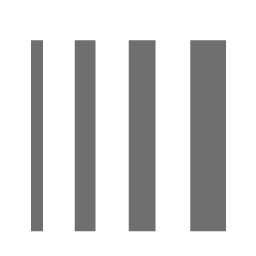 CRC_CurveDisplay · `CrvDpl`

> Custom viewport preview (lineweight, color, dash) for curves — CPython SDK-mode port of CRC_CurveDisplay.

**Inputs**

| Input | Nickname | Type | Access | Description |
|---|---|---|---|---|
| curves | crv | curve | list | Curves to preview |
| colours | col | color | list | Color per curve (last value repeats for remaining curves) |
| widths | w | float | list | Lineweight per curve in pixels (last value repeats) |
| dashes | dash | str | list | Dash pattern per curve: space-separated dash/gap values (e.g. '2 1'); last value repeats |

_None (viewport preview only)._

---

### 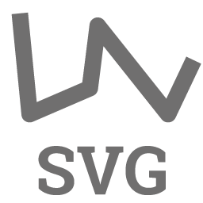 CRC_PolylineToSVG · `PolySVG`

> Converts Grasshopper polylines/polygons to SVG \<polyline\>/\<polygon\> element strings. Closed polylines emit \<polygon\>; open polylines emit \<polyline\>. Coordinates are transformed from Rhino Y-up to SVG Y-down using the canvas anchor.

**Inputs**

| Input | Nickname | Type | Access | Description |
|---|---|---|---|---|
| polylines | pl | curve | list | Polyline geometry or list of polylines |
| strokeColor | sc | color | list | Stroke color or list of stroke colors. Default: none |
| strokeWidth | sw | float | list | Stroke width or list of stroke widths. Default: 0 |
| fillColor | f | color | list | Fill color or list of fill colors. Default: none |
| canvas | canvas | rectangle | item | Rectangle defining the SVG canvas (optional; uses bounding box if not provided) |
| dashPattern | dash | str | list | Stroke dash pattern or list (e.g. '5,5'). Default: '' (solid) |

**Outputs**

| Output | Description |
|---|---|
| svgCode | SVG element string(s); chain into CRC_SaveSVG for file export. |
| report | Status message |

---

###  CRC_CircleToSVG · `CircSVG`

> Converts Grasshopper Circle geometries to SVG \<circle\> element strings. Transforms center from Rhino Y-up to SVG Y-down using the canvas anchor.

**Inputs**

| Input | Nickname | Type | Access | Description |
|---|---|---|---|---|
| circle | c | circle | list | Circle geometry or list of circles |
| strokeColor | sc | color | list | Stroke color or list of stroke colors. Default: none |
| strokeWidth | sw | float | list | Stroke width or list of stroke widths. Default: 0 |
| fillColor | f | color | list | Fill color or list of fill colors. Default: none |
| canvas | canvas | rectangle | item | Canvas rectangle for Y-axis flipping. Default: (0,0,100,100) |
| dashPattern | dash | str | list | Stroke dash pattern e.g. '5,5'. Default: '' (solid) |

**Outputs**

| Output | Description |
|---|---|
| svgCode | SVG element string(s); chain into CRC_SaveSVG for file export. |
| report | Status message |

---

### 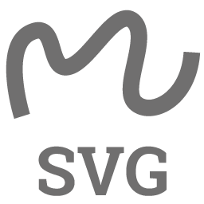 CRC_NurbsToSVG · `NurbsSVG`

> Converts Grasshopper NURBS curves to SVG \<path\> elements via linear-segment approximation at a configurable sample count (default 50). Coordinates are transformed from Rhino Y-up to SVG Y-down using the canvas anchor.

**Inputs**

| Input | Nickname | Type | Access | Description |
|---|---|---|---|---|
| nurbsCurves | n | curve | list | NURBS curve or list of curves |
| sampleCount | s | int | list | Sample count per curve (default 50). Higher = smoother |
| strokeColor | sc | color | list | Stroke color or list of stroke colors. Default: none |
| strokeWidth | sw | float | list | Stroke width or list of stroke widths. Default: 0 |
| fillColor | f | color | list | Fill color or list of fill colors. Default: none |
| canvas | canvas | rectangle | item | Rectangle defining the SVG canvas (optional; uses bounding box if not provided) |
| dashPattern | dash | str | list | Stroke dash pattern e.g. '5,5'. Default: '' (solid) |

**Outputs**

| Output | Description |
|---|---|
| svgCode | SVG element string(s); chain into CRC_SaveSVG for file export. |
| report | Status message |

---

###  CRC_TextToSVG · `TxtSVG`

> Converts text strings with Point3d or Plane insertion to SVG \<text\> elements. Plane input yields rotation from the plane X-axis angle. Justification 1–9 maps to SVG text-anchor/dominant-baseline pairs.

**Inputs**

| Input | Nickname | Type | Access | Description |
|---|---|---|---|---|
| texts | t | str | list | Text string(s) to render |
| points | pt | ghdoc | list | Insertion point(s) or plane(s) for text (Point3d or Plane) |
| fontFamily | ff | str | item | Font family (default 'Arial') |
| fontSize | fs | float | item | Font size in pixels (default 12) |
| fillColor | fc | color | item | Fill color (default black) |
| canvas | canvas | rectangle | item | Rectangle defining the SVG canvas (optional) |
| justification | j | int | list | Justification 1–9 (1=TL 2=TC 3=TR 4=ML 5=MC 6=MR 7=BL 8=BC 9=BR). Default 6 |

**Outputs**

| Output | Description |
|---|---|
| svgCode | SVG element string(s); chain into CRC_SaveSVG for file export. |
| report | Status message |

---

### 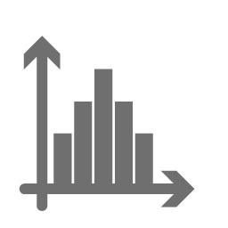 CRC_Histogram · `Hist`

> Renders a histogram chart in the Rhino viewport and exports raw SVG body content. Chain svgCode into CRC_SaveSVG to write the file.

**Inputs**

| Input | Nickname | Type | Access | Description |
|---|---|---|---|---|
| canvasRect | cnv | rectangle | item | Canvas boundary Rectangle3d (default 100x100 at origin) |
| dataValues | val | float | list | Data values to histogram (uses demo data if absent) |
| numBins | bins | int | item | Number of histogram bins (default 10) |
| numXLabels | nxL | int | item | Number of X-axis labels (default: all bin edges) |
| numYLabels | nyL | int | item | Number of Y-axis labels (default 5) |
| decimals | dec | int | item | Decimal places for labels (default 1) |
| axisExtension | axE | float | item | Axis extension beyond canvas (default 0) |
| labelDist | lblD | float | item | Label distance from axis (default 10) |
| drawGridY | gY | bool | item | Draw horizontal grid lines at Y labels (default False) |
| barOutlineWidth | barW | float | item | Bar outline width in pixels (default 1) |
| axisLineWidth | axW | float | item | Axis line width in pixels (default 2) |
| gridLineWidth | grdW | float | item | Grid line width in pixels (default 1) |

**Outputs**

| Output | Description |
|---|---|
| svgCode | Raw SVG body content (no \<svg\> wrapper). Chain into CRC_SaveSVG for file export. |
| report | Verbose status — success details or error trace. |

---

### 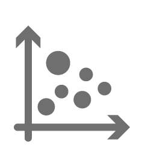 CRC_ScatterPlot · `Scatter`

> Renders a scatter chart in the Rhino viewport and exports raw SVG body content. Chain svgCode into CRC_SaveSVG to write the file.

**Inputs**

| Input | Nickname | Type | Access | Description |
|---|---|---|---|---|
| canvasRect | cnv | rectangle | item | Canvas boundary Rectangle3d |
| xValues | x | float | list | X coordinates of data points (default demo data if absent) |
| yValues | y | float | list | Y coordinates of data points (default demo data if absent) |
| dotRadius | r | float | list | Dot radius — single value or list for variable sizes (default 2.0) |
| numXLabels | nxL | int | item | Number of X-axis labels (default 5) |
| numYLabels | nyL | int | item | Number of Y-axis labels (default 5) |
| decimals | dec | int | item | Decimal places for labels (default 1) |
| axisExtension | axE | float | item | Axis extension beyond canvas (default 0) |
| labelDist | lblD | float | item | Label distance from axis (default 10.0) |
| marginLeft | mL | float | item | Left margin as % of X range (default 0) |
| marginBottom | mB | float | item | Bottom margin as % of Y range (default 0) |
| drawGridX | gX | bool | item | Draw vertical grid lines (default False) |
| drawGridY | gY | bool | item | Draw horizontal grid lines (default False) |
| showLegend | leg | bool | item | Generate color legend (default False) |
| colorValues | cVal | float | list | Values for color mapping; if None uses Y values |
| gradientColors | grad | color | list | Color gradient list for legend (min 2 System.Drawing.Color). Defaults cool-to-warm if absent. |
| numLegendSteps | legN | int | item | Number of legend steps (default 5) |
| legendBarWidth | legW | float | item | Legend bar width (default 5% of canvas) |
| legendDist | legD | float | item | Distance from chart to legend (default 20) |
| legendLabelDist | legLD | float | item | Distance from legend bar to labels (default 5) |
| legendOrientation | legO | str | item | Legend orientation: vertical or horizontal (default vertical) |
| dotOutlineWidth | dotW | float | item | Dot outline width in pixels (default 0.5) |
| axisLineWidth | axW | float | item | Axis line width in pixels (default 2) |
| gridLineWidth | grdW | float | item | Grid line width in pixels (default 1) |

**Outputs**

| Output | Description |
|---|---|
| svgCode | Raw SVG body content (no \<svg\> wrapper). Chain into CRC_SaveSVG for file export. |
| report | Verbose status — success details or error trace. |

---

### 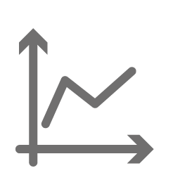 CRC_LinePlot · `LinePlt`

> Renders a line chart in the Rhino viewport and exports raw SVG body content. Chain svgCode into CRC_SaveSVG to write the file.

**Inputs**

| Input | Nickname | Type | Access | Description |
|---|---|---|---|---|
| canvasRect | cnv | rectangle | item | Canvas boundary Rectangle3d (default 100x100 at origin) |
| xValues | x | float | list | X coordinates (flat list = 1 series; DataTree = multi). Uses demo data if absent. |
| yValues | y | float | list | Y coordinates (same shape as xValues). Uses demo data if absent. |
| numXLabels | nxL | int | item | Number of X-axis labels (default 5) |
| numYLabels | nyL | int | item | Number of Y-axis labels (default 5) |
| decimals | dec | int | item | Decimal places for labels (default 1) |
| axisExtension | axE | float | item | Axis extension beyond canvas (default 0) |
| labelDist | lblD | float | item | Label distance from axis (default 10) |
| marginLeft | mL | float | item | Left margin as % of X range (default 0) |
| marginBottom | mB | float | item | Bottom margin as % of Y range (default 0) |
| drawGridX | gX | bool | item | Draw vertical grid lines at X labels (default False) |
| drawGridY | gY | bool | item | Draw horizontal grid lines at Y labels (default False) |
| lineWidth | lnW | float | item | Series line width in pixels (default 2) |
| axisLineWidth | axW | float | item | Axis line width in pixels (default 2) |
| gridLineWidth | grdW | float | item | Grid line width in pixels (default 1) |

**Outputs**

| Output | Description |
|---|---|
| svgCode | Raw SVG body content (no \<svg\> wrapper). Chain into CRC_SaveSVG for file export. |
| report | Verbose status — success details or error trace. |

---

### 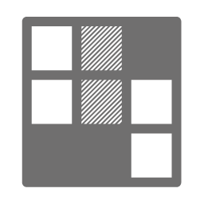 CRC_Heatmap · `HeatMap`

> Renders a heatmap chart in the Rhino viewport and exports raw SVG body content. Chain svgCode into CRC_SaveSVG to write the file.

**Inputs**

| Input | Nickname | Type | Access | Description |
|---|---|---|---|---|
| canvasRect | cnv | rectangle | item | Canvas boundary rectangle (Rectangle3d) |
| dataMatrix | mtx | ghdoc | tree | 2D data matrix (DataTree one branch-per-row or nested list). Defaults to demo data if empty. |
| gradientColors | grad | color | list | Color gradient (min 2 System.Drawing.Color). Defaults cool-to-warm if absent. |
| rowLabels | rLbl | str | list | Row labels as strings (e.g. R1, R2) |
| colLabels | cLbl | str | list | Column labels as strings (e.g. C1, C2) |
| showCellValues | cVal | bool | item | Show numeric values inside cells (default False) |
| decimals | dec | int | item | Decimal places for displayed numbers (default 1) |
| legendSteps | legN | int | item | Number of legend gradient steps (default 5) |
| labelDist | lblD | float | item | Distance from axis labels to chart edge (default 10.0) |
| legendBarW | legW | float | item | Legend bar width (default auto, ~5% canvas dim) |
| legendDist | legD | float | item | Distance from chart area to legend (default 20.0) |
| legendLabelDist | legLD | float | item | Distance from legend bar to its labels (default 5.0) |
| legendOrientation | legO | str | item | Legend orientation: vertical or horizontal (default vertical) |
| showLegend | leg | bool | item | Display legend panel (default True) |
| cellOutlineWidth | cellW | float | item | Heatmap cell-border width in pixels (default 0.5) |
| legendCellOutlineWidth | lcW | float | item | Legend cell border width in pixels (default 0.5) |

**Outputs**

| Output | Description |
|---|---|
| svgCode | Raw SVG body content (no \<svg\> wrapper). Chain into CRC_SaveSVG for file export. |
| report | Verbose status — success details or error trace. |

---

### 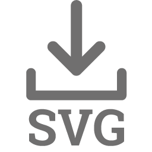 CRC_SaveSVG · `Save`

> Assembles SVG element strings into a complete SVG document (viewBox from canvas dimensions) and writes it to disk. File is only written when save_flag is True.

**Inputs**

| Input | Nickname | Type | Access | Description |
|---|---|---|---|---|
| svgCode | svg | str | list | SVG element string(s) to assemble (list or single string) |
| canvas | canvas | ghdoc | item | Rectangle geometry defining canvas width/height (optional; uses 800x600 default if absent) |
| filePath | path | str | item | Output file path including filename (e.g. C:\output.svg) |
| saveFlag | save | bool | item | Set True to write the file to disk |

**Outputs**

| Output | Description |
|---|---|
| path | Absolute path of the written SVG file |
| svgDoc | Complete SVG document string (for inspection without saving) |
| report | Status message |

---

*Carcará v0.5.1-beta2 · Generated 2026-06-18*
